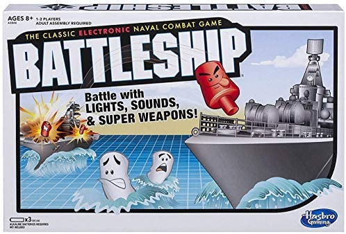

Portfolio
=========

Programming Projects
--------------------

*For access to my private project repositories, please [email me](mailto:mtpoor@csustudent.net?subject=GitHub%20Access) with the subject line, GitHub Access.

---
### [Senior Project Internal Penetration Tester | Senior Project](project1)

---
### [Project 2 Battleship Program | CSCI 235](project2)

---
### [Project 3 Network Servers | CSCI 332](project3)

---
### [Project 4 Ticket Booking System | CSCI 25](project4)

---

Ethics Papers
-------------

### [Paper 1 Title](/pdf/sample_presentation.pdf)

-   **Class:**  
-   **Grade:**

### [Paper 2 Title](/pdf/sample_presentation.pdf)

-   **Class:** 
-   **Grade:**

### [Paper 3 Title](/pdf/sample_presentation.pdf)

-   **Class:** 
-   **Grade:**

---

Presentations
-------------

### [Presentation 1 Title](/pdf/sample_presentation.pdf)

- **Class:** 
- **Grade:**

### [Presentation 2 Title](/pdf/sample_presentation.pdf)

- **Class:** 
- **Grade:**

---

Page template forked from <a href="https://github.com/csu-cs/csci-portfolio">CSU-CS</a>

<!-- Remove above link if you don't want to attributive -->
